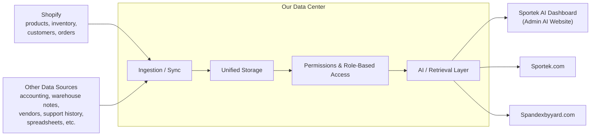

# Sportek AI — Data Flow

```mermaid
flowchart LR
    %% ---- Data Sources ----
    Shopify[Shopify<br/>products, inventory,<br/>customers, orders]
    Other[Other Data Sources<br/>accounting, warehouse notes,<br/>vendors, support history,<br/>spreadsheets, etc.]

    %% ---- Our Data Center (stack) ----
    subgraph DC["Our Data Center"]
        direction TB
        AI["AI / Retrieval Layer"]
        Perms["Permissions &amp; Role-Based Access"]
        Storage["Unified Storage"]
        Ingest["Ingestion / Sync"]
        Ingest --> Storage --> Perms --> AI
    end

    %% ---- Consumers ----
    Admin["Sportek AI Dashboard<br/>(Admin AI Website)"]
    SportekSite["Sportek.com"]
    Spandex["Spandexbyyard.com"]

    %% ---- Flow ----
    Shopify --> Ingest
    Other --> Ingest

    AI --> Admin
    AI --> SportekSite
    AI --> Spandex
```
